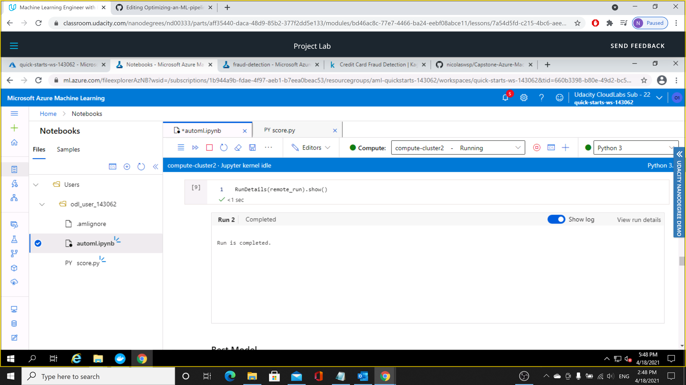
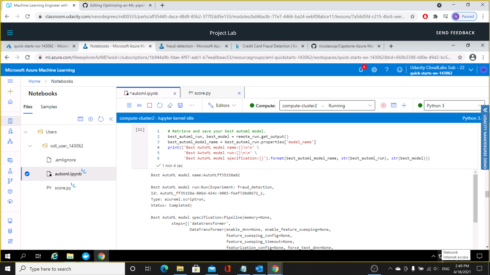
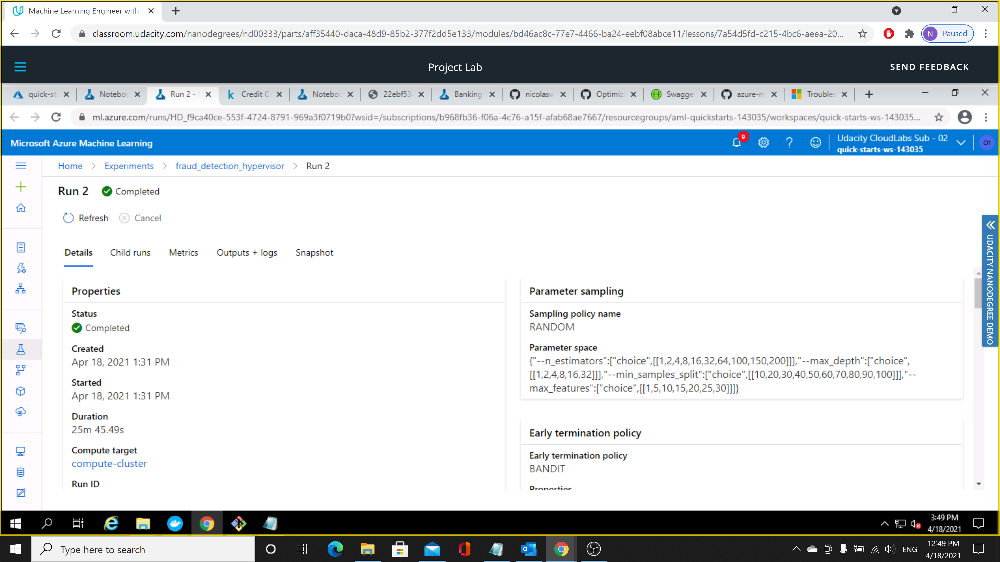
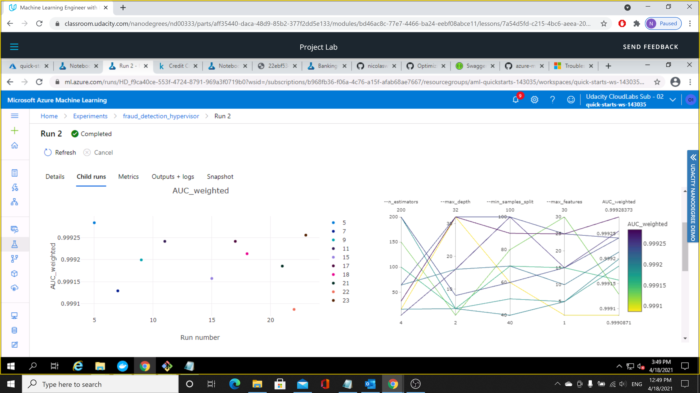
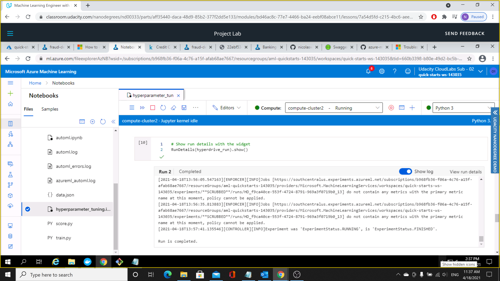
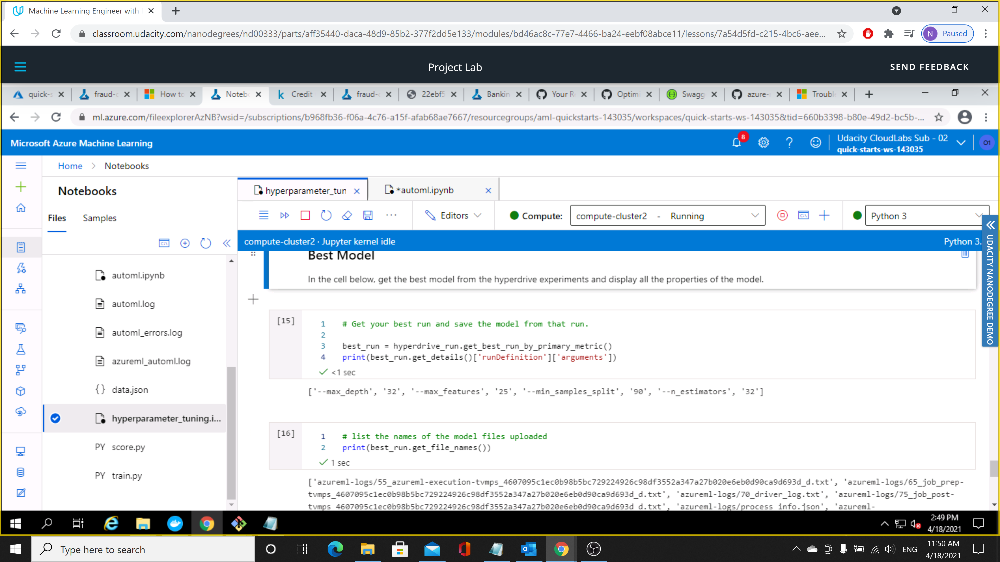
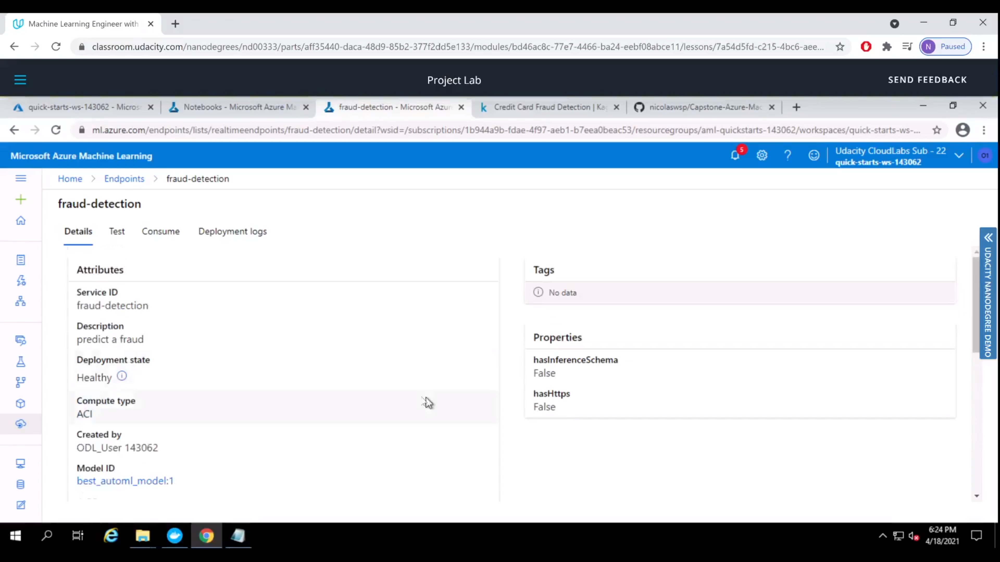
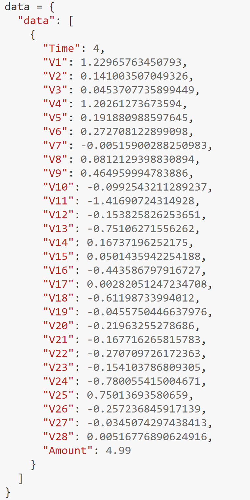

# Training and deploying a credit card fraud detection model in Azure Machine Learning Studio

This project aims to demonstrate how to train a model using Azure Machine Learning Studio and put it in production to an end user. The dataset used was Credit Card Fraud Detection dataset provided in the Kaggle website https://www.kaggle.com/mlg-ulb/creditcardfraud, where the goal is to predict whether a banking transaction would result in fraud based on several features. The training process was made using Auto ML and also HyperDrive through Azure Machine Learning Studio. After that, it was chosen the best model to accordingly to the best algorithm, VotingEnsemble, and deployed into production. With the deployed model, it was enabled the Application Insight using Azure Python SDK. The model was consumed using the deployed scoring URI and running the a notebook cell against the API producing JSON output from the model. 

## Dataset

### Overview

The dataset used was Credit Card Fraud Detection dataset provided in the Kaggle website https://www.kaggle.com/mlg-ulb/creditcardfraud. The dataset contains transactions made by credit cards in September 2013 by european cardholders. This dataset presents transactions that occurred in two days, where we have 492 frauds out of 284,807 transactions. The dataset is highly imbalanced, the positive class (frauds) account for 0.172% of all transactions. It contains only numerical input variables which are the result of a PCA transformation.

### Task

This project main objective is to predict fraud in credit card baking transactions help credit card companies to be able to recognize fraudant transaction to avoid future purcharses that were not requested from the customers. The datatset consists in 30 features containing only numerical input variables which are the result of a PCA transformation to predict the feature 'Class' that is the response variable and it takes value 1 in case of fraud and 0 otherwise.

### Access

This data was downloaded, uploaded and created a dataset with it inside the Azure Machine Learning Studio where the dataset can be consumed through the workspace configuration and the dataset name. 

## Automated ML

Automated Machine Learning was used to train the model in the Azure Machine Learning Studio. For this task the Auto ML main configuration consists in binary classification, for the primary metric was chosen AUC weighted since it works well in imbalanced datasets, and the featurization was chosen to be automatic.

The AutoConfig configuration in the same Notebook followed these steps:

* Created a dataset from the provided Kaggle dataset uploading it on Azure ML Studio
* Splitted data into train and test sets
* Modified the AutoML config
* Submitted the AutoML run
* Saved the best model
* Deployed the best model
* Consumed the best model

The AutoML config was the following parameters:
* experiment_timeout_minutes=20  
  This is an exit criterion when the experiment time exceeds the time out established. This avoids to time out when occurs failures.
* task='classification'  
  This sets the type of experiment that is set to run, in this case was a binary classification.
* primary_metric='AUC_weighted'  
  This sets the primary metric that is used as parameters to choose the best model.
* label_column_name='Class'  
  This criterion sets the dataset collumn that is aimed to be predicted.
* enable_early_stopping=True  
  This sets to enable early termination if the score is not improving in the short term.
* featurization='auto'  
  This is an indicator for whether featurization step should be done automatically or not. 

### Results

The best performing model was the VotingEnsemble among the several tested. It got an AUC_weighted of 0.97. Some of these models were LightGBM, Xgboost, ExtremeRandomTrees, StandardScalerWrapper, RandomForest. A voting ensemble works by combining the predictions from multiple models. It uses Soft Voting that predicts the class with the largest summed probability from models. The AutoML generates parameters of its inner estimators. It can be highlighted that the VotingEnsemble model used L1 Regularization as one of these parameters. The L1 Regularization adds "absolute value of magnitude" of coefficient as penalty term to the loss function shrinking the less important feature’s coefficient to zero thus, removing some feature altogether.

Below you can see the `RunDetails` widget.

The best model trained with its parameters.

## Hyperparameter Tuning

For the hyperparameter tuning using Azure Hyperdrive was chosen to use an ensemble model through the Scikit-Learn library, using a random forest classifier since it is a powerfull ensemble where you can use multiple decision trees. 

The hyperparameters tuned were the following:   
* n_estimators - Inverse of regularization strength
* max_depth - The maximum depth of the tree
* min_samples_split - The minimum number of samples required to split an internal node 
* max_features - The number of features to consider when looking for the best split

The hyperparameters search space was:  
* n_estimators: (1, 2, 4, 8, 16, 32, 64, 100, 150, 200)
* max_depth: (1, 2, 4, 8, 16, 32)
* min_samples_split: (10, 20, 30, 40, 50, 60, 70, 80, 90, 100)
* max_features: (1, 5, 10 , 15, 20, 25, 30)

The early termination policy chosen was Bandit Policy. It is an early termination policy based on slack factor/slack amount and evaluation interval. The policy early terminates any runs where the primary metric is not within the specified slack factor/slack amount with respect to the best performing training run. So, it avoids unnecessary processing.

### Results

The best parameters for the random forest classifier were max_depth=32, max_features=25, min_samples_split=90, n_estimators=32 obtaining a AUC_weighted of 0.99. It can be seen the model run below:

HyperDrive model run

It can be seen the differents hyperparmeter and their influence in the model in the graph below. Using a higher number of hyperparameters during training, the final model tends to get a better performance.

Hyperparameters behavior

Below you can see the `RunDetails` widget.

The best model trained with its parameters.

## Model Deployment
The model chosen to be deployed was the best auto ML model using the Azure Container Instance . It was not enable authentication on the endpoint, so to send requests and recieve predictions it is only required the scoring URI and the correct formatted data. 

The deployed model with its healthy status

A sample of the data to be input in the deployed model

## Screen Recording
Below it is a link to a screen recording of the project in action. The screencast demonstrates:
- A working model
- Demo of the deployed  model
- Demo of a sample request sent to the endpoint and its response

https://www.youtube.com/watch?v=XuTem8o0ZPg&ab_channel=N%C3%ADcolasPauli

## Future improvements
Different techniques can be used to improve the model performance among them include feature engineering, feature selection, ensemble methods, algorithm tunning and cross-validation. In this dataset case, more samples could be added to improve the learning process of the algorithm to retain more patterns. The dataset presented class imbalance, solving this problem would result in a better performance. The training time was also limited, so with more training time the model could capture other different patterns. 
